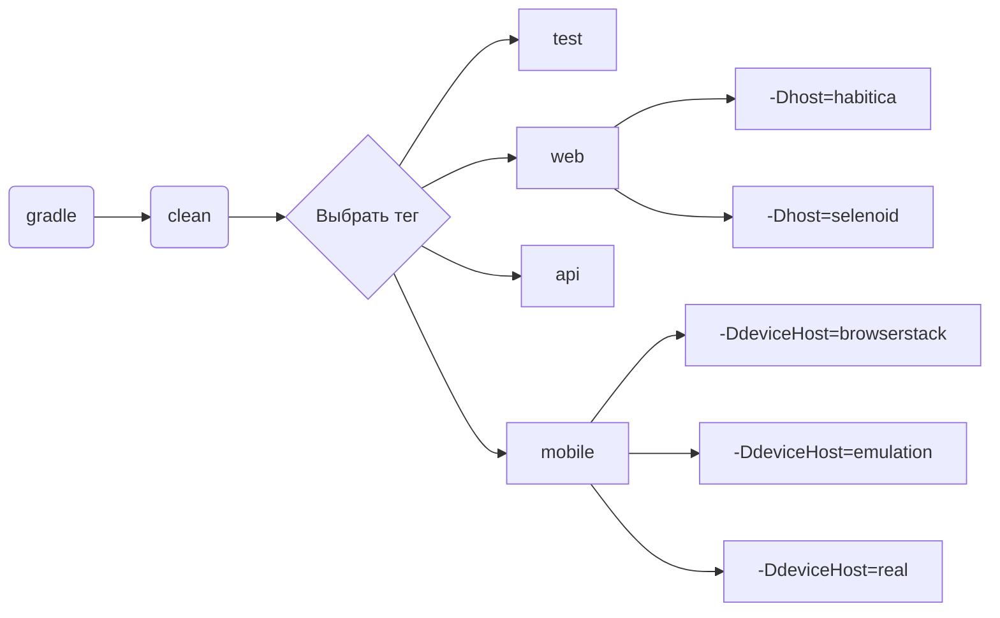

<h1>Проект автоматизации тестирования <a target="_blank" href="https://habitica.com/"> Habitica.com </a> </h1>

<p align="center">
<a href="https://habitica.com/">
</p>

## Содержание
+ [Описание](#Описание)
+ [Технологии и инструменты](#Технологии-и-инструменты)
+ [Реализованные проверки](#Реализованные-проверки)
+ [Запуск тестов](#Запуск-тестов)
    + [Допустимые комбинации](#Допустимые-комбинации)
    + [Локальный запуск тестов](#Локальный-запуск-тестов)
    + [Удаленный запуск тестов](#Удаленный-запуск-тестов)
+ [Cборка тестов в Jenkins](#Cборка-тестов-в-Jenkins)
+ [Интеграция с Allure Report](#интеграция-с-allure-report)
    + [Диаграммы прохождения тестов](#Диаграммы-прохождения-тестов)
    + [Развернутый результат прохождения тестов](#Развернутый-результат-прохождения-тестов)
+ [Интеграция с Allure TestOps](#Интеграция-с-Allure-TestOps)
+ [Интеграция с Jira](#Интеграция-с-Jira)
+ [Уведомления в Telegram с использованием бота](#Уведомления-в-Telegram-с-использованием-бота)
+ [Пример выполнения теста в Selenoid](#Пример-выполнения-теста-в-Selenoid)
  

## Описание
Habitica — трекер задач, который совместил философию RPG и GTD(доведение дел до завершения) в своей веб-версии и приложениях для Android и iOS.
Проект состоит из UI-тестов, API и мобильных тестов на Android. <br/>

**Особенности проекта**:
- `Page Object` шаблон проектирования
- Использование техноголии `Owner` для придания тестам гибкости и легкости конфигурации
- Возможность запуска тестов: локально, удалённо, по тегам
- Использование `Faker` для генерации данных
- Использование `Lombok` для моделей в API тестах
- Использование собственных расширений:
    - `@WithLogin` для предварительной авторизации
- Возможность запуска тестов напрямую из Allure TestOps
- Интеграция с Jira
- Уведомление о результатах прохождения в Telegram
- По итогу прохождения автотестов генерируется Allure отчет. Содержание отчета:
    - Шаги теста
    - Скриншот страницы на последнем шаге
    - Исходный код страницы в браузере
    - Логи консоли браузера
    - Видео выполнения автотеста

## Технологии и инструменты

<div align="center">
<a href="https://www.jetbrains.com/idea/"></a>
<a href="https://github.com/"></a>  
<a href="https://www.java.com/"></a>
<a href="https://gradle.org/"></a>  
<a href="https://junit.org/junit5/"></a>
<a href="https://selenide.org/"></a>
<a href="https://aerokube.com/selenoid/"></a>
<a href="https://rest-assured.io/"></a>
<a href="https://www.browserstack.com/"></a>
<a href="https://appium.io/"></a>
<a href="https://developer.android.com/studio"></a>
<a href="https://www.jenkins.io/"></a>
<a href="https://github.com/allure-framework/"></a>
<a href="https://qameta.io/"></a>
<a href="https://www.atlassian.com/software/jira"></a>  
<a href="https://telegram.org/"></a>
</div>

## Реализованные проверки
### Web
- [x] Проверка владельца испытания
- [x] Проверка возможности перехода к Правилам сообщества
- [x] Проверка логотипа
- [x] Навигация по разделам главной страницы
- [x] Навигация по разделам Faq
- [x] Проверка отправки сообщения в чат команды
- [x] Проверка возможности создания задачи

### Api
- [x] Позитивный тест на авторизацию
- [x] Негативный тест на авторизацию
- [x] Тест на получение списка тэгов
- [x] Тест на удаление задачи
- [x] Тест на добавление задачи через Api

### Mobile
- [x] Проверка экрана авторизации
- [x] Проверка возможности пропустить Intro
- [x] Проверка экрана регистрации

## Запуск тестов

### Допустимые комбинации



### Локальный запуск тестов
#### Запуск всех тестов

Для запуска следует открыть IntelliJ IDEA и выполнить в терминале:
```
gradle clean test -Dhost=habitica
```

#### WEB

```
gradle clean web -Dhost=habitica
```

#### API
```
gradle clean api -Dhost=habitica
```

#### Mobile
Для запуска тестов на реальном устройстве:
```
gradle clean mobile -DdeviceHost=real
```
Для запуска тестов на эмуляторе
```
gradle clean mobile -DdeviceHost=emulation
```
Для запуска тестов на удаленной ферме:
```
gradle clean mobile -DdeviceHost=browserstack
```

<details>
   <summary>Дополнительные команды:</summary>
  
1. Выполнить запрос на формирование отчета:
```
gradle allureReport
```
2. Открыть отчет в браузере:
```
gradle allureServe
```

</details>

### Удаленный запуск тестов
Тесты можно запустить из терминала IntelliJ IDEA, а выполнены они будут в удаленно запущенном браузере в Docker-контейнере Selenoid:

```
gradle clean test -Dhost=selenoid
```

Параметры, которыми можно управлять:
```
-DbrowserName - наименование браузера. По умолчанию chrome
-DbrowserSize - размер окна браузера. По умолчанию 1980x1080
-DbrowserVersion - номер версии браузера. По умолчанию 100.0
-DbaseUrl - адрес Habitica
```

## Cборка тестов в <b><a target="_blank" href="https://jenkins.autotests.cloud/job/27-Ga9nrad-HabiticaPatent/">Jenkins</a></b>

>Для запуска сборки необходимо перейти в раздел `Build with Parameters` и нажать кнопку `Build`
>Сборка с параметрами позволяет перед запуском задать нужные параметры для сборки:
 


## Интеграция с <b><a target="_blank" href=" ">Allure report</a></b>
#### Диаграммы прохождения тестов
`ALLURE REPORT` - отображает дату и время теста, общее количество запущенных тестов, а также диаграмму с процентом и количеством успешных и провалившихся тестов <br/>
`TREND` - отображает тенденцию выполнения тестов<br/>
`SUITES` - отображает распределение тестов по сьютам <br/>
`CATEGORIES` - отображает распределение неудачных тестов по типам дефектов


#### Развернутый результат прохождения тестов:


## Интеграция с <b><a target="_blank" href=" ">Allure TestOps</a></b>

>Диаграммы прохождения тестов
>


## Интеграция с <b><a target="_blank" href=" ">Jira</a></b>

>В Jira создана задача
>


>В разделе `Allure:Test Cases` отображаются тесты


## Уведомления в Telegram с использованием бота

> Бот, созданный в Telegram, после завершения сборки отправляет сообщение с отчетом о прохождении тестов
> 


## Пример выполнения теста в Selenoid

> К каждому UI-тесту в отчете прилагается видео
<p align="center">
  
</p>

> К каждому мобильному тесту, выполняемому в Browserstack, к отчету прилагается видео
<p align="center">
  
</p>
